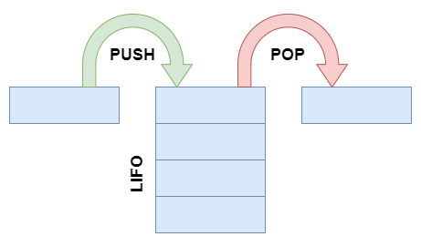
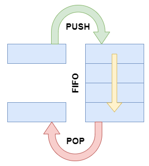

# Javascript Calculator

## Описание проекта

Написан на чистом JavaScript, вычисляет значения математических выражений.

Пример математического выражения:

```
1 + 2 - 3 * 4 ^ 5
```

Полученные навыки:

- Работа с flex и grid элементами
- Работа с типами данных в JS. Особенности работы с числами
- Понимание принципа работы структур данных: стек, очередь
- Понимание обратной польской записи и алгоритма сортировочной станции
- Реализация модального окна
- Работа с localStorage в JS
- Обработка неккоректного пользовательского ввода (например: "2+*3" (после знака сложения не может быть знак умножения)

## Описание алгоритма работы калькулятора

1. Ввод математического выражения и проверка на корректность
2. Преобразуем строку выражения в массив токенов
3. Преобразуем инфиксную запись в постфиксную
4. Вычисляем выражение

## Глоссарий

Токен - число, математическое действие или функция (sin, cos, tg и др.).

Стек - структура данных, представляющая из себя упорядоченный набор элементов, в которой добавление новых элементов и удаление существующих производится с одного конца, называемого вершиной стека. Притом первым из стека удаляется элемент, который был помещен туда последним, то есть в стеке реализуется стратегия «последним вошел — первым вышел» (last-in, first-out — LIFO).



Очередь - это структура данных, добавление и удаление элементов в которой происходит путём операций push и pop соответственно. Притом первым из очереди удаляется элемент, который был помещен туда первым, то есть в очереди реализуется принцип «первым вошел — первым вышел» (англ. first-in, first-out — FIFO).



## Описание алгоритма сортировочной станции

- Пока не все токены обработаны:
    - Прочитать токен
    - Если токен - _число_, то добавить его в очередь вызова
    - Если токен - _префиксная функция_ или _открывающая скобка_, кладём в стек
    - Если токен - _закрывающая функция_, то:
        - Если в стеке нет закрывающей скобки, то скобки не согласованы
        - Иначе пока на вершине стека не _закрывающая скобка_, выталкиваем элементы стека в очередь
        - Саму _закрывающую скобку_ просто убираем из стека
    - Если входной токен - _бинарная функция_:
        - Пока на вершине стека _префиксная функция_ или операция на вершине стека приоритетнее входного токена, выталкиваем элемент стека в очередь
        - Кладём входной токен в стек
    - Выталкиваем элементы стека в очередь

[Вернуться назад](/README.md)